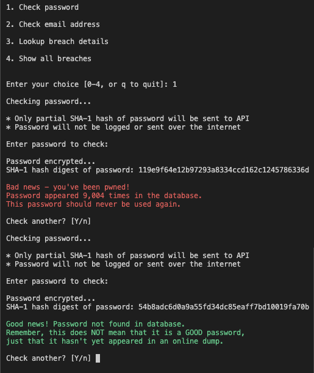
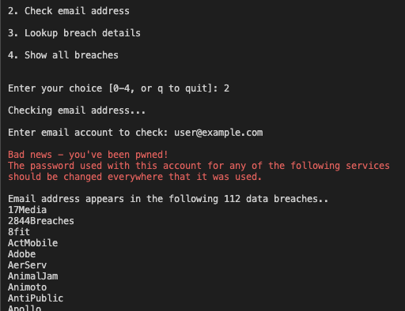
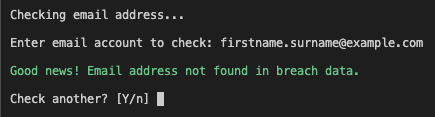
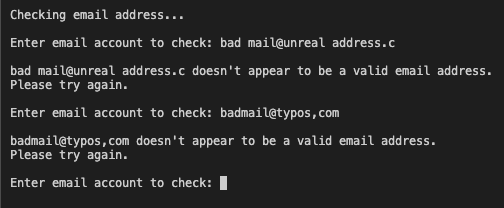
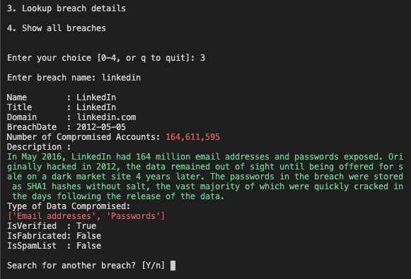
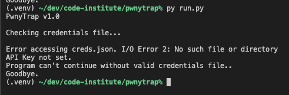
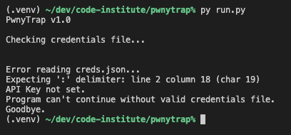
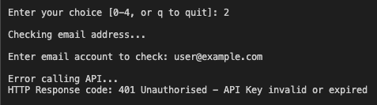

# PwnyTrap

### A Python tool to query the https://haveibeenpwned.com API to see if a given password or email address has been compromised in a data breach.
 

You can view the PwnyTrap live app [HERE.](https://ci-pp3-pwnytrap.herokuapp.com/)
 
 
#_TODO Screen sample image goes here
<h2 align="center"></h2>

## - Table of Contents -
* [Purpose](#purpose)
* [User Experience Design (UX)](#user-experience-design)
* [Features](#features)
* [Technologies](#technologies)
* [Testing](#testing)
* [Deployment](#deployment)
* [Credits](#credits)

## - Purpose -
[ This app was created as the third Portfolio Project (PP3) for the Code Institute's Full Stack Web Development course. The app is to showcase Python skills, and as a requirement is deployed to Heroku using a Code Institute mock terminal template.]  

In short:  
A Python tool to query the HaveIBeenPwned API to see if a given password or email address was compromised in a data breach.

In more detail:   
PwnyTrap's purpose on one level is to be a simple tool to easily enable password & email address lookups to the HIBP database.  On another level, it was created as an idea for a Python module which could be imported for use in future projects to enhance IT security.  

PwnyTrap's primary audience is the IT professional, but it is in fact relevant to all online users and can be easily used by anyone without them having concern for the underlying API or code.  

I hope this app sparks conversation amongst software developers around the concept of incorporating a HibpAPI class, or similar implementation, into an app's login or registration handling code.

## - User Experience Design -

-   ### Design
    -   #### Layout
        The program is designed as a command-line app and to run in the Code Institute project terminal on Heroku.  The default maximum terminal screen width is 80 characters and default height is 24 characters. The terminal window automatically scrolls up. The user interface design is a simple menu-driven text application with keyboard input only. (Note: Code Institute supply the web site wrapper template for Heroku deployment.) 
    -   #### Content
        The user is presented with a main screen displaying the menu options available. They can enter a number to open that menu option.  The Help/Info screen option presents its own screen of text content.  All other content is generated dynamically based on either the user's input or relevant system messages and the screen will scroll up to display it.
    -   #### User Input
        Depending on the option chosen, the user inputs a value and hits the Enter key to submit to the API search. If the data entered is invalid the user is informed and asked to re-enter it. For all options the system awaits a Yes/No response - this ensures that the user has time to read the information. The input is designed to make the user's workflow easier by defaulting to either Y or N in the most likely situation. This allows the user to repeat the option by just hitting Enter, e.g. 'Check another? [Y/n]' - hitting enter here accepts the default answer 'Y(es)'.  Overall, the user can accomplish tasks with minimal input.  

## - Features -  
- **Check Password** allows the user to type in a password. For confidentiality, the letters typed are not shown on screeen. Internally the password is encrypted using the SHA-1 hashing algorithm and only the first five characters are used to build the search query for the API. The response will indicate whether the password was compromised and how many times it appears in the database. The message is dsplayed in red if it was matched and green if it wasn't.  
(You can read more about implementing password privacy using the k-anonymity model [here](https://www.troyhunt.com/ive-just-launched-pwned-passwords-version-2/#cloudflareprivacyandkanonymity).)
<h2 align="center"></h2>

- **Check Email Address** allows the user to type in an email address. The input is checked to ensure that a correctly formatted email address was entered (_not_ that it is a _live_ email account) and if so the database is searched and a relevant message displayed.
<h2 align="center"></h2>
<h2 align="center"></h2>
<h2 align="center"></h2>

- **Lookup Breach Info** allows the user to enter a breach name 
<h2 align="center"></h2>  

- **List All Breaches in the HIBP database** returns all 500+ breach names displayed in three columns. User can scroll through the list. Enter Y or y to return to the menu.
<h2 align="center"></h2>  

- **API Key** This app requires a valid [HaveIBeenPwned.com] API Key and when first run the program checks for its presence in a file called creds.json is the same folder as run.py

## - Future Features -
-   Refactor the HibpAPI class to search on NTLM hashes (aka NTHash) of the given password.  Could create an option or separate Active Directory test tool using HIBP's offline NTLM hash dump.
-   Create an option (or separate tool) to scan a company's whole email domain for accounts exposed in a breach
-   Any idea that helps the IT security team identify vulnerabilites or encourages better end user security practises  
<!--  -->
<!-- End Features -->
<!--  -->

## - Technologies Used -

### Languages Used

-   [Python 3](https://en.wikipedia.org/wiki/Python_(programming_language))

### Frameworks, Libraries & Programs Used

1.  [Git](https://git-scm.com/) was used for version control and managed via the VSCode terminal to commit to Git and Push to GitHub.
1.  [GitHub](https://github.com/) was used to store the project's code after being pushed from Git
1.  [Flake8](https://flake8.pycqa.org/en/latest/) linter extension for VScode 
1.  [Heroku](https://www.heroku.com) was used to deploy the app using a Code Institute template
1.  [LucidChart](https://lucidchart.com) was used to create the logic flowchart

<!---  --->
<!---  Begin testing section --->
<!---  --->

## - Testing -
<h2 align="center"></h2>
<h2 align="center"></h2>

On program start I tested that the credentials file exists and contains a readabe API key.  The first error shows if the file can't be found and the second if its contents are not valid, e.g. I removed the colon delimiter from the JSON api key data. In either either case the program can't continue, clearly informs the user, and gracefully exits. 
<h2 align="center"></h2>
<h2 align="center"></h2>

I tested for and invalid API key.
<h2 align="center"></h2>

### Code Validation
-   The [PEP8 Online](http://pep8online.com) linter was used to ensure the code adhered to the Python Style Guidelines.
<h2 align="center"></h2>

-   https://pythex.org was used to test regular expressions with various inputs
-   #_TODO

### Bugs  

1. In the `check_password()` function, initially when using `hashlib.sha1()` to encrypt the password, I made the mistake of not encoding the password using `password.encode('utf-8')`. **Fixed.**
2. Initially tried to use `resp.text` to parse the results of the breach search before realising it should have been `resp.json()` which correctly parses to a list of dictionaries for further processing. **Fixed.** 
3. Regex used to validate email addresses incorrectly rejected email addresses containing an apostrope. **Fixed.** 
<!---  --->
<!--- end of testing section --->
<!---  --->

## - Deployment -

### Heroku  
The live deployed site can be viewed on Heroku [HERE](https://ci-pp3-pwnytrap.herokuapp.com)

The Project repository (repo) is at [https://github.com/davewatters/pwnytrap](https://github.com/davewatters/pwnytrap-ci-pp3)

Note: The project repo was initially generated from the [Code Institute Python Essentials template](https://github.com/Code-Institute-Org/python-essentials-template) 

Deployment of the site to Heroku was done as follows:
 
1.  Login to your Heroku account
1.  Create a New App
1.  (Important!) Select the 'Settings' tab first
1.  Click on 'Reveal Config Vars'
1.  Add any relevant config vars by entering the KEY/VALUE pair data, e.g. PORT & 8000
1.  Select 'Add Buildpack'
1.  (Important!) Select Python first, then select NodeJS
1.  Select the 'Deploy' tab
1.  For the Deplyoment Method select GitHub
1.  Connect to GitHub repo by entering YOUR-REPO-NAME, then Connect
1.  A message will confirm that your app was successfuly deployed
1.  Test that the site has successfully gone live by clicking on the 'View' button
1.  Your app can now be accessed via any browser at: `https://YOUR-APP-NAME.heroku.com`

## - Credits - 

-   Project inspired by [Troy Hunt's](https:/troyhunt.com) [Have I Been Pwned](https://haveibeenpwned.com) website
-   Full HIBP API v3 Specification Document [HERE](https://haveibeenpwned.com/API/v3)

### Code
-   No code was directly copied to this project but numerous resources helped me understand what I needed and how best to code it. These include: The official [Python Docs](https://docs.python.org), StackOverflow.com, W3Schools.com, RealPython.com  
-   Automate the Boring Stuff with Python, 2nd Edition - Al Sweigart. Very helpful as an intro to implementing regex searching in Python and also working with the requests and json modules
-   https://www.regular-expressions.info/email.html
-   Other projects using the HIBP API providing inspiration included:  
    https://github.com/Radial01/PwnyCorral  
    https://github.com/lionheart/pwnedpasswords    
    https://github.com/RubikX/HIBP-Python/  

### Acknowledgements

-   The HIBP database and API were created by Troy Hunt and licensed under the Creative Commons Attribution 4.0 International Licence
-   My mentor [Daisy McGirr](https://github.com/Daisy-McG) for all her helpful feedback and knowledge.
-   The Code Institute community on Slack and the CI staff and students for their feedback and support.
