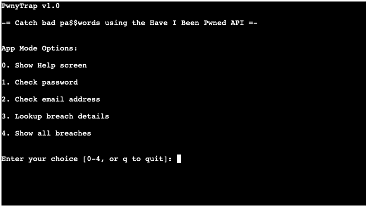

# PwnyTrap

### A Python tool to query the https://haveibeenpwned.com API to see if a given password or email address has been compromised in a data breach.  

<!-- <h2 align="center"></h2> -->

## Table of Contents  
* [Purpose](#purpose)
* [Features](#features)
* [Requirements](#requirements)
* [Usage](#usage)
* [Future Features and Bugs](#future-features-and-bugs)
* [Deployment](#deployment)
* [Credits](#credits)

## Purpose      
[This app was created as the third Portfolio Project (PP3) for the Code Institute's Full Stack Web Development course. The app is to showcase Python skills, and as a requirement is deployed to Heroku using a Code Institute mock terminal template.]  

PwnyTrap is Python tool to query the HaveIBeenPwned.com API to see if a given password or email address was compromised in a data breach.

PwnyTrap's purpose on one level is to be a simple tool to easily enable password & email address lookups to the HaveIBeenPwned.com (aka HIBP) database. On another level, it was created as an idea for a Python module which could be imported for use in future projects to enhance IT security, for example, during a user signup/registration process.


## Features    

- **Check Password** The password is SHA-1 hashed then only the first five characters are used to build the search query for the API. This API 'range search' returns multiple hash suffixes to preserve the anonymity of the user. (You can read more about implementing password privacy using the _k-Anonymity model_ [here](https://www.troyhunt.com/ive-just-launched-pwned-passwords-version-2/#cloudflareprivacyandkanonymity).) 


- **Check Email Address** allows the user to type in an email address. The input is checked to ensure that a valid, i.e. a _correctly formatted_, email address was entered (does _not_ check if it is a live email account)

- **Lookup Breach Info** allows the user to enter a breach name and call up full details of the breach including a description and the details of types of data exposed in the breach.

- **Show All Breaches** returns all 500+ breach names in the HIBP database.


## Requirements 
- Python 3.6  
- The following dependencies are imported:
    - `getpass`, `hashlib`, `json`, `re`, `requests`, `textwrap` 


- **API Key** To search for compromised email addresses this app requires a valid HaveIBeenPwned.com API Key and when first run the program checks for its presence in a file called `creds.json`.  The key is not required for password searches.  The credentials file has the following format:
```
{
  "hibp-api-key": "[_SECRET_API_KEY_]"
}
```


## Usage  
```
python3 run.py
```

## Future Features and Bugs  

### Future Features
-   Refactor the HibpAPI class to search on NTLM hashes (aka NTHash) of the given password.  Create an option or separate Active Directory test tool using HIBP's offline NTLM hash dump.
-   Create an option (or new tool) to scan a company's whole email domain for accounts exposed in a breach
-   Any idea that helps the IT security team identify vulnerabilites or encourages better end user security practises  


### Bugs  

1. None known at this time


## Deployment

### Heroku  
The Project repository (repo) is at [https://github.com/davewatters/pwnytrap](https://github.com/davewatters/pwnytrap)

Note: The project repo was initially imported from my [Code Institute Portfolio Project 3](https://github.com/davewatters/pwnytrap-ci-pp3) and the live deployed project can be viewed on Heroku [HERE](https://ci-pp3-pwnytrap.herokuapp.com)

Deployment of the site to Heroku was done as follows:
 
1.  Login to your Heroku account
1.  Create a New App
1.  (Important!) Select the 'Settings' tab first
1.  Click on 'Reveal Config Vars'
1.  Add any relevant config vars by entering the KEY/VALUE pair data, e.g. PORT & 8000
1.  Select 'Add Buildpack'
1.  (Important!) Select Python first, then select NodeJS
1.  Select the 'Deploy' tab
1.  For the Deplyoment Method select GitHub
1.  Connect to GitHub repo by entering YOUR-REPO-NAME, then Connect
1.  A message will confirm that your app was successfuly deployed
1.  Test that the site has successfully gone live by clicking on the 'View' button
1.  Your app can now be accessed via any browser at: `https://YOUR-APP-NAME.heroku.com`


## Credits 

-   Project inspired by [Troy Hunt's](https:/troyhunt.com) [Have I Been Pwned](https://haveibeenpwned.com) website
-   Full HIBP API v3 Specification Document [HERE](https://haveibeenpwned.com/API/v3)

-   A shout out to **https://pythex.org** which was used to test the regular expressions used. 

-   Other projects using the HIBP API providing inspiration included:  
    https://github.com/Radial01/PwnyCorral  
    https://github.com/lionheart/pwnedpasswords    
    https://github.com/RubikX/HIBP-Python/  

### Acknowledgements

-   The HIBP database and API were created by [Troy Hunt](https:/troyhunt.com) and licensed under the [Creative Commons Attribution 4.0 International Licence](https://creativecommons.org/licenses/by/4.0/)

